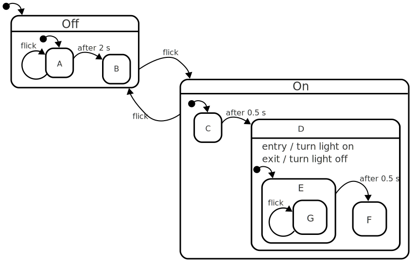
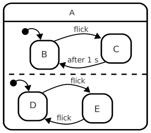

# XSM-CSharp
A tentative C# port of Etienne Blanc's [XSM plugin](https://gitlab.com/atnb/xsm) for the Godot Engine
Doesn't work at the moment, I"m not sure if it ever will


XSM Extended State Machine
==========================

Latest version : 1.5.4

A freely inspired implementation of [StateCharts](https://statecharts.github.io/what-is-a-statechart.html) for Godot. This plugin provides States composition (ie sub-States), regions (ie parallel States) and helper functions for animations and timers. It is licensed MIT and written by [ATN](https://gitlab.com/atnb).


For the very first state machine with XSM, try our [HelloWorld example](https://gitlab.com/atnb/xsm#hello-world) down this page. You can also look at the very simple example provided with this plugin to have a glimpse of what is possible with it.


Understanding XSM
-----------------

A Finite State Machine (FSM) is a way for game creators to separate their code's logic into different parts. In Godot, it would be in different Nodes. XSM allows to have substates of a State so that you don't have to create a complex inheritage pattern. You can simply add State Nodes as children of a State Node. If you do so, when a child is active, all his parents are active too and they are going to proceed (update).

If a State has_regions, all its children are active or inactive at the same time, as soon as it is active or inactive.

It allows schemas such as :



_more on : [StateCharts](https://statecharts.github.io/what-is-a-statechart.html)_


How to use XSM
---------------

You can add a StateRoot node to your scene. This State will be the root of your XSM. Then you can add different States to this root and separate the logic of your scene into those different sub-States. You can also add a State as a child of another State and create complex trees of States by doing so.

The RootState is a special State that owns a state_map dictionary (contains the list of all the State names as a key and their State node's reference as a value). It also contains a list of all the current active States.

By default, your XSM is enabled, you can disable it (or any branch of you XSM's tree) in the inspector.

You can us the same names for states in different branches of your StateMachine but THEIR PARENT NAMES MUST BE DIFFERENT. In the state_map and active_states_list, they will be referenced as "ParentName/ChildName" to differentiate theme.

The state_root owns a history of the active_states_list, the size of which can be changed in the StateRoot's inspector. You can call `was_active("StateName")` to know if the StateName was active last frame. Careful: if two states have the same name, they are referenced as "ParentName/StateName" in the state's history.

Each State can have its own target (any Node of the scene, including another State) and animation player specified in the inspector. If you don't, XSM will get the root's ones. If the root does not have a target, it will use its parent as target. If the root does not have an AnimationPlayer, it will just give you a warning.

An empty State template is provided in [res://script_template/empty_state.gd](https://gitlab.com/atnb/xsm/-/blob/master/script_templates/empty_state.gd). You just need to add a script to your State and specify this one as a model.


**Abstract functions to inherit in you states**

When you enter a State (with `change_state("State")`), XSM will first exit the old branch. Starting from the common root of the new State and the old one, it will call `_before_exit()`, exit the children, then call `_on_exit()`.
Then it will enter the new branch. Starting from the common root of the new State and the old State, it will call `_on_enter()`, enter the proper child, then call `_after_enter()` for the child and eventually `_after_enter()` for the root. If the specified State is not the last of the branch, XSM is going to enter each following first chid.
During your scene's `_process()`, XSM will update the active root and call `_on_update()`, then `_on_update()` for its active child (or children if there are regions), `_after_update()` for the child and eventually `_after_update()` for the root.
If you add any timer to a State (with `add_timer("name",time)`) as soon as the timer is done, it calls `_on_timeout("name")` and destroys itself. If it had this timer's name already as a child, the old timer is destroyed and a new one is created with the specified time.

So, in each State's script, you can implement the following virtual public functions:
```csharp
public override void _OnEnter() {}
public override void _AfterEnter() {}
public override void _OnUpdate(_delta) {}
public override void _AfterUpdate(_delta) {}
public override void _BeforeExit() {}
public override void _OnExit() {}
public override void _OnTimeout(_name) {}
```


**Utility functions to call in your States**

In any State node, you can call the following public functions:

* `ChangeState("MyState") : State`
   where "MyState" is the name of an existing Node State. If two states have the same name, you MUST add the parent's name before change_state("Parent/Child")

* `ChangeState("MyState", args_on_enter = null, args_after_enter = null, args_before_exit = null, args_on_exit = null) : State`
   The "change_state" method accepts arguments, to be able to pass variables to some inherited enter or exit functions in your states' logic.
   
* `GotoState("MyState")`
   an alias for change_state(). Attention, no arguments allowed there !
   
* `IsActive("MyState") : bool`
   returns true if a state "MyState" is active in this xsm
   
* `Was_active("MyState") -> bool`
   returns true if a state "MyState" was active in this xsm last frame (_physics_process)
   
* `was_active("MyState", history_id) -> bool`
   returns true if a state "MyState" was active in this `xsm history_id + 1` frames (_physics_process) ago
   
*  `GetActiveStates() : Dictionary<string, State>`
   returns a dictionary with all the active States

*  `GetPreviousActiveStates(history_id) : Dictionary<string, State>`
   returns a dictionary with all the active States from `history_id + 1` frames ago

* `GetActiveSubstate() : Godot.Collections.Array`
   if active, returns the active substate (or all the children if has_regions)

* `FindStateNode("MyState") : State`
   returns the State Node "MyState", You have to specify "Parent/MyState" if "MyState" is not a unique name.

* `GetState("MyState") : State`
   an alias for find_state_node()

* `Play("Anim")`
   plays the animation "Anim" of the State's AnimationPlayer

* `PlayBackwards("Anim")`
   plays the animation "Anim" of the State's AnimationPlayer, starting from the end

* `PlayBlend("Anim", custom_blend = 0.0, custom_speed = 1.0, from_end = false)`
   blends the animation "Anim" with the current one of the State's AnimationPlayer (plays both animation during the custom_blend time)

* `PlaySync("Anim", custom_speed = 1.0, from_end = false)`
   synchronizes the animation "Anim" with the current animation of the State's AnimationPlayer

* `Pause()`
   pauses the current animation

* `Queue("Anim)`
   queues the animation "Anim" at the end of the State's AnimationPlayer list. If the current animation is looping, the queue will NOT play.

* `Stop()`
   stops the current animation

* `IsPlaying("Anim)`
   returns true if "Anim" is playing

* `AddTimer("Name", time)`
   adds a timer named "Name" and returns this timer
   when the time is out, the function `_on_timeout(_name)` is called
   
* `DelTimer("Name")`
   deletes the timer "Name"
   
* `DelTimers()`
   deletes all the timers of this State
   
* `HasTimer("Name")`
   returns true if there is a Timer "Name" running in this State


**Signals**

The States are calling different signals during their life :

* `public delegate void StateEntered(State sender);`
* `public delegate void StateExited(State sender);`
* `public delegate void StateUpdated(State sender);`
* `public delegate void StateChanged(State sender, string newState);`
* `public delegate void SubstateEntered(State sender);`
* `public delegate void SubstateExited(State sender);`
* `public delegate void SubstateChanged(State sender, string newState);`
* `public delegate void Disabled();`
* `public delegate void Enabled();`

The StateRoot has additional signals :

* `public delegate void SomeStateChanged(State senderNode, string newStateNode);`
* `public delegate void PendingStateChanged(State addedStateNode);`
* `public delegate void PendingStateAdded(string newStateName);`
* `public delegate void ActiveStateListChanged(Godot.Collections.Dictionary<string, State> activeStatesList);`


Hello World
-----------------

Your first try with XSM could be to :
* Install the module (using godot's AssetLib on the top of your editor)
* Activate the module (project / parameters / Extensions and check activate for XSM)
* Select the node that needs a StateMachine (for example a character)
* Add a new child node (or Ctrl-A) of type StateRoot
   You should see a yellow warning on your StateRoot node, select the node and in the inspector, assign your character node as your StateRoot's target
* You can now add two State nodes to your StateRoot (same as above : Ctrl-A)
* Add a script to the first State and chose the Empty State template.
* Add a script to the second State and chose the Empty State template.
* in the first script, in the _on_enter(_args) function, add a line with:
   `print("Hello world of state 1")`
* then in the _on_update(_delta) function, add:
 ```gdscript
   if Input.is_action_just_pressed("ui_accept"):
      change_state("State2")
```
* in the second script, in the _on_enter(_args) function, add a line with:
   `print("Hello world of state 2")`
* then in the _on_update(_delta) function, add:
 ```gdscript
   if Input.is_action_just_pressed("ui_accept"):
      change_state("State")
```
And here you are, you made your first state machine with XSM!


Special Thanks
-----------------

To TealOrbiter for such kind and useful suggestions that make xsm getting better each version.


What's next ?
-----------------

Well now you can create open source games with Godot and share, right ?

For any question, issue or request, `atn@lail.fr` or gitlab.
_See you_
